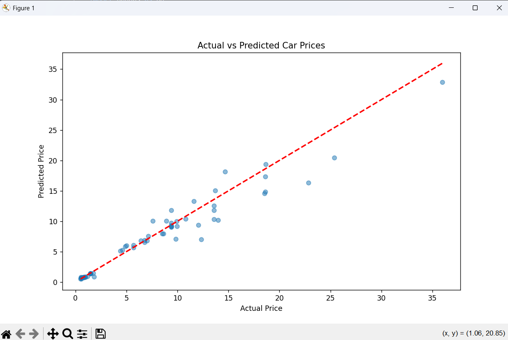

---

## 🚗 Car Price Prediction App

A machine learning web application built with **Flask** to predict the price of a used car in Indian Rupees (₹).
Enter car details like name, year, mileage, fuel type, etc., and get an instant price prediction!

---

## 🧩 Table of Contents

* [About](#about)
* [Features](#features)
* [Tech Stack](#tech-stack)
* [How it Works](#how-it-works)
* [Folder Structure](#folder-structure)
* [Installation](#installation)
* [Usage](#usage)
* [Example Prediction](#example-prediction)
* [Future Improvements](#future-improvements)
* [License](#license)


## 📖 About

This project demonstrates:
✅ End-to-end machine learning pipeline
✅ Data preprocessing & feature engineering
✅ Model training & saving with `joblib`
✅ Deployment as a Flask web application

It predicts the selling price (in lakhs) based on car attributes like:

* Car Name
* Year of manufacture
* Total kilometers driven
* Fuel type

---

## ✨ Features

* Simple and clean HTML frontend (`index.html`)
* Takes car details as input
* Uses a trained **Random Forest model** (`rf_model.pkl`)
* Reuses the **same preprocessor** (`preprocessor.pkl`) used during training to keep consistency
* Displays predicted price instantly in rupees (₹)

---

## 🛠 Tech Stack

* Python 🐍
* Flask 🌱
* Pandas, NumPy
* Scikit-learn (Random Forest)
* joblib (for saving/loading models)
* HTML, CSS (for frontend)

---

## ⚙️ How it Works

✅ User enters car details →
✅ Data converted to DataFrame →
✅ Uses saved `preprocessor.pkl` to transform input →
✅ Transformed data passed to `rf_model.pkl` →
✅ Model predicts price →
✅ Result displayed on the page

All of this happens in real time when user hits the **Predict** button!

---

## 📁 Folder Structure

```
car-price-predictor/
├── app.py                     # Flask app (main backend code)
├── data_processing.py         # Data preprocessing module
├── models/
│   ├── rf_model.pkl          # Trained Random Forest model
│   └── preprocessor.pkl      # Saved preprocessor (e.g., ColumnTransformer)
├── templates/
│   └── index.html             # Frontend HTML page               
├── requirements.txt
└── README.md
```

---

## 💻 Installation

**1️⃣ Clone the repository**

```bash
git clone https://github.com/yourusernaSiddique-Aham/car-price-predictor.git
cd car-price-predictor
```

**2️⃣ Install dependencies**

```bash
pip install -r requirements.txt
```

Make sure you have:

* `models/rf_model.pkl`
* `models/preprocessor.pkl`

> If not, train your model and save it first.

---

## ▶️ Usage

Run the Flask app:

```bash
python app.py
```

Then open browser at:

```
http://127.0.0.1:5000/
```

Enter details → click **Predict** → get predicted price.

---

## 🧪 Example Prediction

✅ Car Name: `Honda City`
✅ Year: `2016`
✅ Mileage (kms): `50000`
✅ Fuel Type: `Petrol`

➡️ **Predicted Price:** `₹8.75 Lakhs`

*(Actual result may vary based on model training)*

---

## 🔮 Future Improvements

* Add fields for Selling type, Transmission, Owner (instead of default values)
* Use advanced frontend (Bootstrap / React)
* Deploy on Heroku / AWS
* Add graphs & data visualization
* Use more advanced ML or deep learning models

---

## 📝 License

This project is open source and available under the MIT License.

---

## ✏️ Author

Built by Siddique Mohammad Aham with ❤️

---


